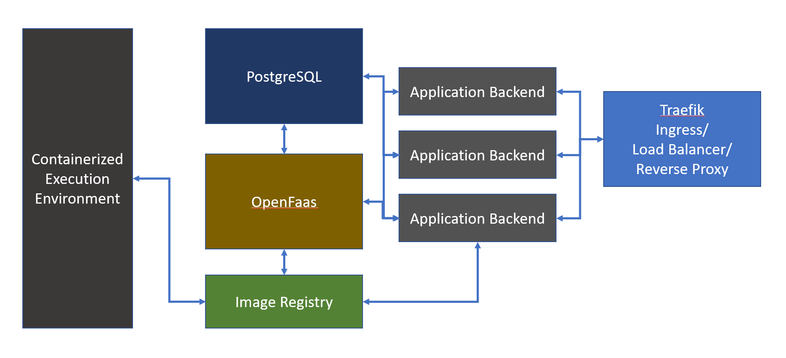

# BudgetLambda
## [Donglin Xu](xu.dong@northeastern.edu), [Chen Qiu](qiu.chen1@northeastern.edu), [Yiheng Niu](niu.yih@northeastern.edu)

# Project Description

The aim of the project is to provide a bare-minimum, yet completely function implementation which resembles amazon lambda- a serverless provider that supports function-snipped based development and deployment with scalability.

# Architecture

# Platform and Tools

The project will be hosted on a 4-node Kubernetes cluster with OpenFaas as its core execution and deployment environment. A custom built backend and frontend stack will handle user interaction as well a authentication and authorization. A private image registry and a PostgreSQL database will handle data storage. Load balancing will be implemented both in L2 level (LAN, based on ARP broadcasting) and in L7 level (Traefik)

# Planned Benchmarks and Experiments

1. Functions written in different languages with same computational goals will be deployed and have their performance cross-compared under different replicas.

2. An End-to-End development to deployment process will be experimented which consists of writing, deploying and triggering.

# Planned analysis

1. With unified entry points for each function (HTTP/RabbitMQ), load testing can be employed to determine the performance across different functions and different scales.

2. A detailed report can be produced to demonstrate the general workflow.

# Distributed systems :)

- Different components will be running on different physical machines, that's distributed!

- Components will sometimes hot-swap across machines, that's distributed!

- Multiple replicas of the same component will be running at the same time while communicating with each other to ensure consistency, that even more distributed!